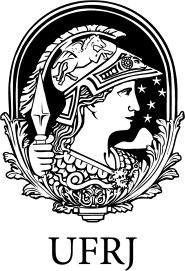
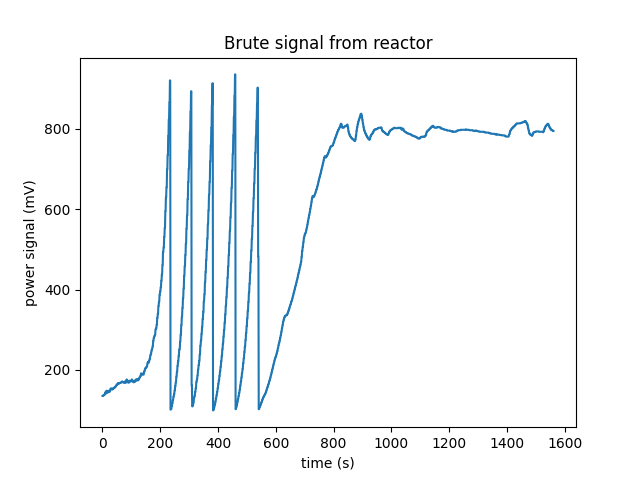

# Projeto de Reatímetro
_Desenvolvimento de um sistema de monitoramento da operação de reator nuclear por meio do cálculo de cinética pontual inversa para medição da reatividade em tempo real. Pesquisa financiada pelo CNPQ, feita em colaboração com o IEN (Instituto de Engenharia Nuclear)._

---

---
## Tecnologias e dependências:

* Arduino ou Raspberry Pie 3
* Python 3x
* Bibliotecas Python:
    * Pandas, 
    * Matplotlib,
    * Numpy,
    * csv,
    * Pyserial (para receber os dados eletrônicos da instrumentação).

## Arquivos:

* ./imgs: Pasta contendo as imagens para conteúdo explicativo, principalmente para o arquivo README.md do github (no caso, esse que você está lendo agora).

* signal.csv: Arquivo excel (tabela) que contém a tabela de valores colhidos diretamente da potência do reator.  Lembrando que está em escala log. Essa tabela não será alterada, para evitar qualquer mudança indesejada dos dados iniciais.

* data.csv: Arquivo excel (tabela) que conterá as diversas colunas necessárias para a operação completa.

* logtolin.py: Faz a conversão do sinal bruto do reator logarítimico para uma escala linear.

* smoother.py: Suaviza a curva de potência do reator para trabalharmos as derivadas e integrais de forma mais precisa.

* historical.py: Trabalha os dados e faz o histórico de potência ponto a ponto.

* reactivity.py: Em última instância, gera os valores de reatividade ponto a ponto e plota o resultado final.

* main.py: se encarrega de puxar todas as outras funções dos outros programas e rodá-los sequencialmente.

## Plano de Trabalho:

1. Ter um arquivo .csv (é o tipo de arquivo excel, uma tabela normal de valores) para trabalhar as colunas. No primeiro arquivo só haverá tempo e sinal, que são os dados iniciais que temos. Na segunda, já trabalharemos os seus valores coluna por coluna. A primeira dessas colunas sendo o dado de sinal bruto e a segunda o sinal linear; a terceira será o sinal linear suavizado, a quarta histórico e a quinta reatividade.

 O primeiro arquivo já foi abordado. O arquivo signal.csv carrega os dados brutos do reator, que foram já plotados abaixo.

Gráfico 1: Sinal bruto da instrumentação do Argonauta. É possível ver a natureza oscilatória causada pela limitação da instrumentação nativa. 

2. Receber e converter os dados lidos pelo sensor eletrônico do reator em uma escala linear. Montar uma lista ou array desses valores convertidos.

 Isso será feito por meio do arquivo logtolin.py, que em breve será implementado.

3. Suavizar esses dados de leitura pelo método da média móvel. Comparar dados de potência ruidosos e suaves.

 Estou estudando as possíveis estratégias para a suavização da curva que surge linearizada. A natureza ruidosa dos dados reais atrapalha o seu tratamento via diferenciação e integração. Queremos minimizar o erro decorrente desses processos.

4. A partir dos dados suavizados, gerar os arranjos de histórico e de reatividade e então plotá-los.