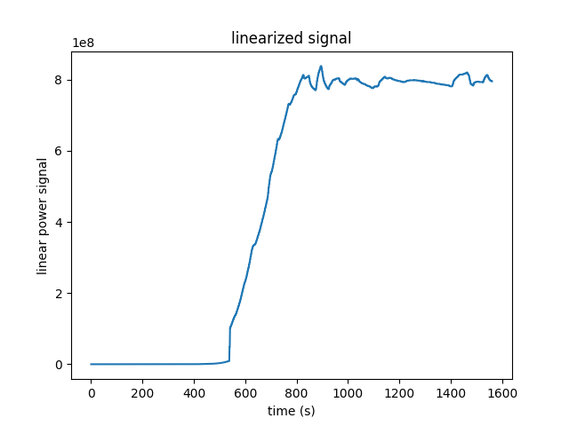
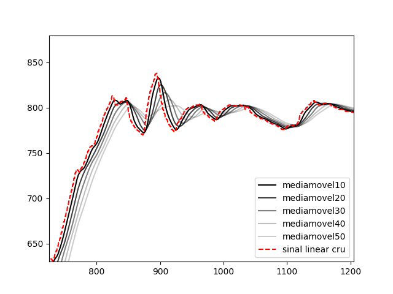

# Projeto de Reatímetro
_Desenvolvimento de um sistema de monitoramento da operação de reator nuclear por meio do cálculo de cinética pontual inversa para medição da reatividade em tempo real. Pesquisa financiada pelo CNPQ, feita em colaboração com o IEN (Instituto de Engenharia Nuclear)._

---

---
## Tecnologias e dependências:

* Arduino ou Raspberry Pie 3
* Python 3x
* Bibliotecas Python:
    * Pandas, 
    * Matplotlib,
    * Numpy,
    * csv,
    * Pyserial (para receber os dados eletrônicos da instrumentação).

## Arquivos:

* ./imgs: Pasta contendo as imagens para conteúdo explicativo, principalmente para o arquivo README.md do github (no caso, esse que você está lendo agora).

* signal.csv: Arquivo excel (tabela) que contém a tabela de valores colhidos diretamente da potência do reator.  Lembrando que está em escala log. Essa tabela não será alterada, para evitar qualquer mudança indesejada dos dados iniciais.

* data.csv: Arquivo excel (tabela) que conterá as diversas colunas necessárias para a operação completa.

* logtolin.py: Faz a conversão do sinal bruto do reator logarítimico para uma escala linear.

* smoother.py: Suaviza a curva de potência do reator para trabalharmos as derivadas e integrais de forma mais precisa.

* historical.py: Trabalha os dados e faz o histórico de potência ponto a ponto.

* reactivity.py: Em última instância, gera os valores de reatividade ponto a ponto e plota o resultado final.

* main.py: se encarrega de puxar todas as outras funções dos outros programas e rodá-los sequencialmente.

## Plano de Trabalho:

1. Ter um arquivo .csv (é o tipo de arquivo excel, uma tabela normal de valores) para trabalhar as colunas. No primeiro arquivo só haverá tempo e sinal, que são os dados iniciais que temos. Na segunda, já trabalharemos os seus valores coluna por coluna. A primeira dessas colunas sendo o dado de sinal bruto e a segunda o sinal linear; a terceira será o sinal linear suavizado, a quarta histórico e a quinta reatividade.

 O primeiro arquivo já foi abordado. O arquivo signal.csv carrega os dados brutos do reator, que foram já plotados abaixo.

Gráfico 1: Sinal bruto da instrumentação do Argonauta. É possível ver a natureza oscilatória causada pela limitação da instrumentação nativa. 

2. Receber e converter os dados lidos pelo sensor eletrônico do reator em uma escala linear. Montar uma lista ou array desses valores convertidos.

 Isso foi feito por meio do arquivo logtolin.py, que automatiza o processo de conversão, assim possibilitando futuras leituras igualmente velozes de outros dados recebidos.

3. Suavizar esses dados de leitura pelo método da média móvel. Comparar dados de potência ruidosos e suaves.

 No presente momento, acabo de experimentar a função de média móvel simples nos dados linearizados de potência. O teste foi feito para os n's de 10, 20, 30, 40 e 50. Segue o gráfico da região mais ruidosa da curva abaixo: 

Nos próximos passos, estarei prosseguindo com os cálculos do histórico e da reatividade para cada n. Há um tradeoff entre suavidade e atraso temporal, para os diferentes valores de n. Por isso, é necessário escolher o menor n viável para que a curva já seja suave o suficiente. Essa escolha será determinada empiricamente de acordo com as curvas de reatividade calculadas a partir de cada um.

Ainda nessa questão, será experimentado também como alternativa o modelo de média móvel exponencial, que usa uma média ponderada (com maior peso nas amostragens mais recentes) para poder dessa forma maximizar o nosso ganho de suavidade e não perder tanto em relação ao atraso (visto que nossa curva suave tenderá mais para os dados atuais).

4. A partir dos dados suavizados, gerar os arranjos de histórico e de reatividade e então plotá-los.